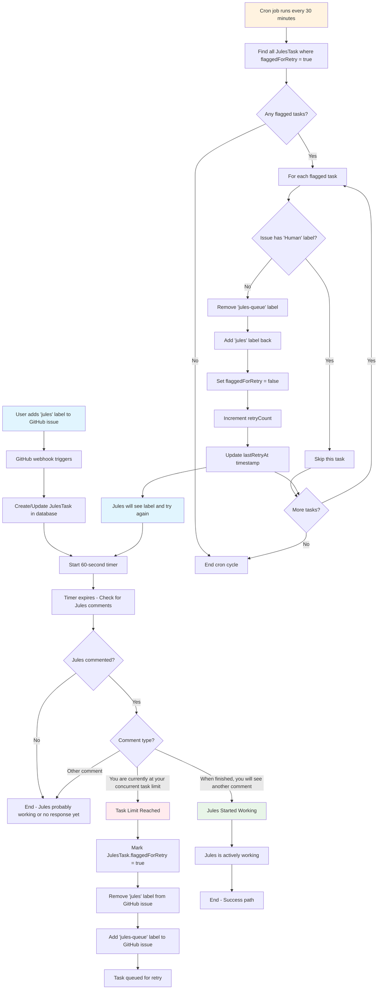

# AGENTS RULES OVERVIEW

## You are an expert.

You are an EXPERT software engineer and system designer - all of your code will be reviewed by an expert reviewer of your work - optimize for them to not have to change your code or leave comments on your code.

This document condenses the most critical rules for agents working on this repository. Note that Jules (you) doesn't have access to enviormental variables and cannot run commands like `pnpm build` because of this, instead use `pnpm lint` - The best option is to use `pnpm lint && pnpm build` to run both linting and building at the same time.

---

## Project Overview

Contents of the README.md file:

  
  <h1 align="center">Jules Task Queue</h1>
  

    An overengineered, enterprise-grade, open-source task queue for Jules power users.
  

---

Jules Task Queue is a GitHub-integrated service that solves the "3 concurrent task" bottleneck when using the Google Labs - Jules AI coding assistant. It automatically queues tasks when Jules hits its limit and retries them later, allowing you to seamlessly utilize your full daily quota.

## The Problem: The 3-Task Bottleneck

> "Jules gives you 15 tasks per day but only 3 concurrent slots.\* So you're constantly babysitting the queue, manually re-adding labels every time it hits the limit. There has to be a better way."
> — Every Jules power user, probably

This tool is the better way. It transforms Jules from a tool you have to manage into a true "set it and forget it" automation partner.

## ✨ Features

- **🤖 Task Status Detection**: Automatically detects when Jules is at capacity and intelligently queues new tasks.
- **🔄 Auto-Retry Logic**: 30-minute retry cycles with intelligent label swapping and failure recovery.
- **🚀 Easy Self-Hosting**: Deploy with one click to Vercel, Firebase, or use the provided Docker Compose setup.
- **🔐 GitHub Native**: Secure webhook integration with signature verification and comprehensive audit logging.
- **🔒 Type Safe**: End-to-end TypeScript with tRPC and Zod validation for bulletproof deployments.
- **⚙️ Zero Config (Hosted)**: Install the GitHub App and you're done. No complex setup required.

## 🚀 Getting Started

You can use our hosted version for a zero-config setup or deploy your own instance.

### Hosted Version (Recommended)

1.  **Visit our website**: Go to [https://jules.hildy.io](https://jules.hildy.io) to get started with the hosted version.
2.  **Follow the setup guide**: Complete the guided installation process for the GitHub App.
3.  **Add the `jules` label** to any GitHub issue to start processing.

  

### Self-Hosting

Deploy your own instance with one click:

[]
[![Deploy to Firebase]](https://julesqueue.hildy.io/)

For detailed instructions on self-hosting with **Docker**, **Vercel**, or **Firebase**, please see our documentation:

- [**SELF_HOSTING.md**](./SELF_HOSTING.md)
- [**GITHUB_APP_SETUP.md**](./GITHUB_APP_SETUP.md)
- [**FIREBASE.md**](./FIREBASE.md)

## 🛠️ How It Works

The system is designed to be a robust, hands-off automation layer on top of your existing GitHub workflow.

## 📢 Disclaimer

Jules Task Queue is an independent productivity tool created by the developer community. We are not affiliated with Jules, Google, or Google Labs in any way. Jules Task Queue simply helps you manage your Jules task queue more efficiently.

## 0. General Rules

Always run `pnpm lint` at the end of your response after making your changes. Use ALL warnings and errors as a feedback loop and continue your same response by fixing ALL warnings and errors in an enterprise expert SWE + non-lazy way. Loop the `pnpm lint` until there are ZERO errors or warnings with the files you have edited. Then after fully completing the feedback loop perform the same with `pnpm build` and feedback loop until there are ZERO warnings or errors.

Don’t be lazy; always investigate thoroughly and address ROOT causes rather than merely treating symptoms.

---

## 1. Project Tech Stack

• **Always** use these technologies **together** so we can move fast and break nothing: Next.js (App Router) · TypeScript + ESLint · Zod + Prisma + tRPC + React Query · Prisma (Supabase) + Redis · ShadCN + TailwindCSS v3 · pnpm.
• Use `pnpm` (never `npm`) and `pnpm dlx` (never `npx`).
• After code changes run `pnpm lint`.
• Default to **React Server Components**; mark client components with `"use client"` only when browser APIs or state are required.
• Follow Next.js data-fetching hierarchy: `generateStaticParams` → `fetchCached` → `fetch`.
• Use `next/image` with lazy loading and `sizes` for responsive images; prefer WebP/AVIF assets in `/public`.
• Stick to Tailwind utility classes; build custom primitives with ShadCN when utilities are insufficient.
• All new packages must support **ES modules**; add via `pnpm add -w` to keep lockfile consistent.
• Testing & linting are part of CI: `pnpm lint && pnpm test` before merge.

---

## 2. TypeScript Standards

• Put **all** type/interface definitions in `app/types/` – never inline duplicates.
• Re-use or extend existing types before making new ones; prefer interfaces, avoid enums and `any`.
• Enable `strict` compiler options: no implicit `any`, explicit return types, strict-null checks.
• File names **kebab-case**; PascalCase for interfaces/types.
• Document `unknown` casts with a comment **one line above** explaining why.
• Prefer generics over union overloads; keep generic constraints tight (`<T extends Record<string, unknown>>`).
• Export from `app/types/index.ts` to create a single import path.
• Do **not** duplicate DB snake_case fields in camelCase; keep one source of truth.
• Use mapped types (`Partial<T>`, `Pick<T, K>`) to derive variants rather than redefining.
• Each function exported from a module must declare its full return type – including `void` where applicable.

---

## 3. Web Expert (Frontend/UI)

• Use Tailwind for styling, ShadCN + Radix primitives, Framer Motion for animation.
• Keep `use client` components minimal; favour RSC, Suspense, dynamic imports.
• Mobile-first, responsive design; optimize Web Vitals (LCP/CLS/FID).
• Component/dir names in `kebab-case`; export components by name.
• Adhere to **WCAG 2.1 AA** accessibility: semantic HTML, ARIA only when needed.
• Motion prefers GPU-accelerated transforms (`translate`, `opacity`); **never** animate `width/height` on large elements.
• Tailwind breakpoints: `sm 640`, `md 768`, `lg 1024`, `xl 1280`, `2xl 1536` – keep overrides scoped.
• Use `clsx` or `tailwind-merge` to compose classNames.
• Avoid global CSS except variables & font-faces inside `app/globals.css`.
• Icons come from `/public/icons` or Lucide; import as React components.

---

## 4. React Query Best Practices

• Encapsulate data access in custom hooks (`useXQuery`, `useYMutation`).
• Separate query & mutation files; prefetch likely routes; invalidate on writes.
• Handle errors & retries centrally; implement optimistic updates where it helps UX.
• **Stable query keys** must be arrays (`['campaign', id]`) not interpolated strings.
• Configure `staleTime` ≥ 30 s for infrequently changing resources; keep `cacheTime` modest to control memory.
• Disable `refetchOnWindowFocus` when real-time syncing exists (e.g. Ably channel).
• Leverage `queryClient.prefetchQuery` in `<Link onMouseEnter>` handlers for snappy page loads.
• Use `useInfiniteQuery` for streams/pagination; pass `getNextPageParam`.
• Wrap the app in `<QueryClientProvider>`; optionally include Devtools in dev builds.
• After mutations call `queryClient.invalidateQueries` or use `onSuccess` callback for fine-grained cache updates.

---

## 5. tRPC Best Practices

• Keep routers separate from business logic; compose routers hierarchically.
• Validate **every** input with Zod; generate & export types from schemas.
• Use middleware for auth, RBAC, logging; throw `TRPCError` for failures.
• Never access DB directly in routers—use service / repository layers.
• Distinguish `publicProcedure` vs `protectedProcedure` for authenticated endpoints.
• Store current user & prisma client on the **context** object; type it globally.
• Prefer **camelCase** procedure names; group related procedures under feature routers.
• Enable **batching** and `links.loggerLink` in dev to trace calls.
• Return minimal fields; rely on Zod output schemas to strip/expose only allowed data.
• Capture and surface Zod errors via `errorFormatter` to the client.

---

## 6. Zod Guidelines

• Organize schemas per domain (`schemas/`); compose & reuse via `extend`, `intersection`, `union`.
• Use `.safeParse` & typed guards for runtime validation.
• Provide defaults, custom refinements, informative error messages.
• Keep schemas immutable; export both `schema` and `type Schema = z.infer<typeof schema>`.
• Version breaking schema changes in comments and migrations.
• Use `.transform()` for input → domain conversions (e.g., dollars → cents).
• Combine `.refine` and `.superRefine` for cross-field checks (e.g., `endDate` > `startDate`).
• Avoid `.any()` – define explicit shapes; mark optional fields with `.optional()` not `.nullish()` unless needed.
• Centralize common primitives (email, phone, id) in `schemas/shared.ts` to deduplicate.
• Map Zod issues to form errors via `zodResolver` (react-hook-form) or custom helper.

---

## 7. Prisma Best Practices

• **Never** expose raw Prisma client; wrap in repository/service functions.
• Validate input with Zod before DB ops; use transactions & `$transaction`.
• Optimize queries (select/include minimal fields, avoid N+1, paginate).
• Manage schema with migrations; keep seed & shadow DB scripts.
• Enable **row-level security** in Supabase; double-check policies on every new table.
• Use relation querying (`include`, `select`) instead of multiple round trips.
• Keep environment secrets in `.env`; **do not** commit DB URLs or keys.
• Surfaces errors as `TRPCError` codes (`'INTERNAL_SERVER_ERROR'`, `'CONFLICT'`).
• Profile queries with `LOG_LEVEL=query`; avoid full-table scans – add indexes via migrations.
• Use `prisma.$extends` or middleware for soft deletes, auditing, or logging.

---

## 8. Redis Guidelines

• Use connection pooling & retry with back-off; secure with TLS & ACLs.
• Establish meaningful key prefixes/namespaces; set TTLs; avoid large values.
• Batch operations via pipelines/Lua; never run blocking commands like `KEYS`/`FLUSHALL` in prod.
• Prefer colon-separated keys (`campaign:123:leaderboard`); avoid spaces.
• Serialize complex objects as JSON; compress big payloads with gzip.
• Monitor `INFO memory`, `SLOWLOG`, and key eviction metrics; tweak `maxmemory-policy`.
• Use `SCAN`/`SSCAN` instead of `KEYS` for pagination to keep instance responsive.
• Set TTLs on session & cache keys; periodically audit for orphaned data.
• Employ **atomic** `MULTI/EXEC` or Lua scripts to avoid race conditions.
• Restrict commands per role using ACL files; disable `EVAL` if Lua is not required.

---

## 9. Vitest Testing Standards

• Place test files beside source (`*.spec.ts`/`*.test.ts`).
• Follow AAA (Arrange-Act-Assert) structure & descriptive names.
• Mock only external deps; clean up in `afterEach`; run tests in parallel.
• Cover unit, integration, e2e flows; use MSW or stubs for network.
• Leverage `vi.mock()` and `vi.spyOn()` for precise, typed mocks.
• Speed up local runs with `vitest --changed` or `--related <file>`.
• Keep tests deterministic: avoid timers, randomness; if needed, seed RNG and use fake timers.
• Use `test.each` for table-driven cases instead of repetitive copy-paste.
• Snapshot test only stable, deterministic output; avoid large HTML dumps.
• Include CI badge and coverage reporting (`pnpm vitest run --coverage`).

---

### Global Conventions

• Concise, functional, declarative TypeScript.
• Descriptive variables (`isLoading`, `hasError`).
• Prefer iteration & modularization over duplication.

> Adhering to these condensed rules keeps the codebase safe, maintainable, and fast-moving.
