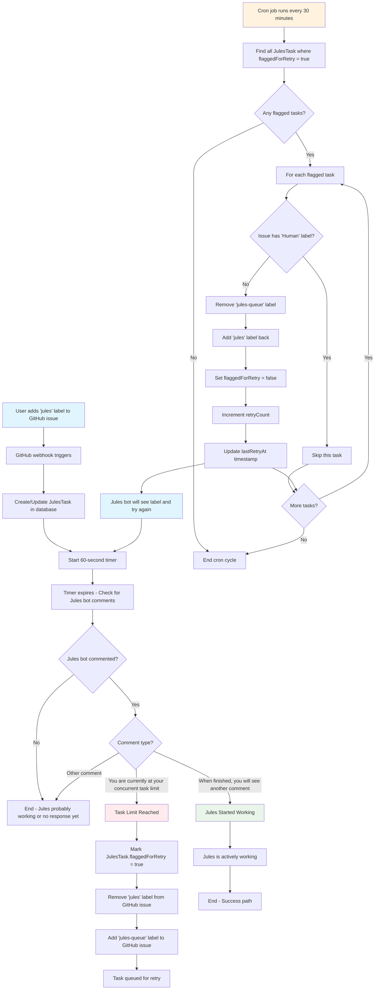

# Jules Task Queueing System

## Overview

The Jules Task Queueing System is a GitHub-integrated service that manages task overflow for the Google Labs Jules AI assistant. When Jules reaches its concurrent task limit, this system automatically queues tasks and retries them at regular intervals.

## System Architecture



## Key Components

### 1. GitHub Webhook Handler

- **Trigger**: When `jules` label is added to an issue
- **Action**: Creates/updates JulesTask record
- **Delay**: Waits 60 seconds before checking for bot responses

### 2. Comment Detection System

- **Purpose**: Monitors Jules bot responses after label application
- **Detection Patterns**:
  - Task limit: `"You are currently at your concurrent task limit"`
  - Success: `"When finished, you will see another comment"`

### 3. Queue Management

- **Queueing**: Moves tasks from `jules` → `jules-queue` when limit reached
- **Retry Logic**: Cron job processes queued tasks every 30 minutes
- **Safety**: Skips tasks with `Human` label (manual intervention required)

### 4. Database Schema

```prisma
model JulesTask {
  id                 Int      @id @default(autoincrement())
  githubRepoId       BigInt
  githubIssueId      BigInt   @unique
  githubIssueNumber  BigInt
  flaggedForRetry    Boolean  @default(false)
  retryCount         Int      @default(0)
  lastRetryAt        DateTime?
  createdAt          DateTime @default(now())
  updatedAt          DateTime @updatedAt
}
```

## Core Functions

### 1. Task Creation

```typescript
async function upsertJulesTask(params: {
  githubRepoId: bigint;
  githubIssueId: bigint;
  githubIssueNumber: bigint;
}) {
  // Create/update task record
  // Start 60-second delay timer
  // Check for Jules bot comments
  // Handle task limit or success responses
}
```

### 2. Retry Processing

```typescript
async function retryFlaggedJulesTasks() {
  // Find all flagged tasks
  // Skip tasks with 'Human' label
  // Re-apply 'jules' label
  // Remove 'jules-queue' label
  // Update retry metrics
}
```

## GitHub Labels

- **`jules`**: Active task - Jules should process this
- **`jules-queue`**: Queued task - waiting for retry
- **`Human`**: Manual intervention - skip automatic processing

## Environment Requirements

- GitHub webhook configured for `issues.labeled` events
- GitHub API token with repo access
- Database for task persistence
- Cron job capability for retries

## Retry Strategy

- **Interval**: Every 30 minutes
- **Persistence**: Tasks remain queued until successful or manually resolved
- **Metrics**: Tracks retry count and timestamps
- **Safety**: Human label prevents infinite retries

## Error Handling

- Graceful webhook failures
- GitHub API rate limiting
- Network timeouts
- Database connection issues
- Missing environment variables

## Security Considerations

- GitHub webhook signature verification
- Encrypted API token storage
- Input validation and sanitization
- Rate limiting on endpoints
- Audit logging for all operations

## Monitoring & Observability

- Task creation and completion metrics
- Retry attempt tracking
- Queue depth monitoring
- Error rate alerting
- Performance metrics for webhook processing

## Future Enhancements

1. **Priority Queueing**: Handle urgent tasks first
2. **Dynamic Retry Intervals**: Exponential backoff for repeated failures
3. **Multi-Repository Support**: Centralized queueing across repos
4. **Webhook Delivery Guarantees**: Retry failed webhook deliveries
5. **Task Analytics**: Success rates, processing times, bottlenecks
6. **Auto-scaling**: Detect Jules capacity and adjust accordingly
7. **Integration Testing**: Automated end-to-end workflow validation
