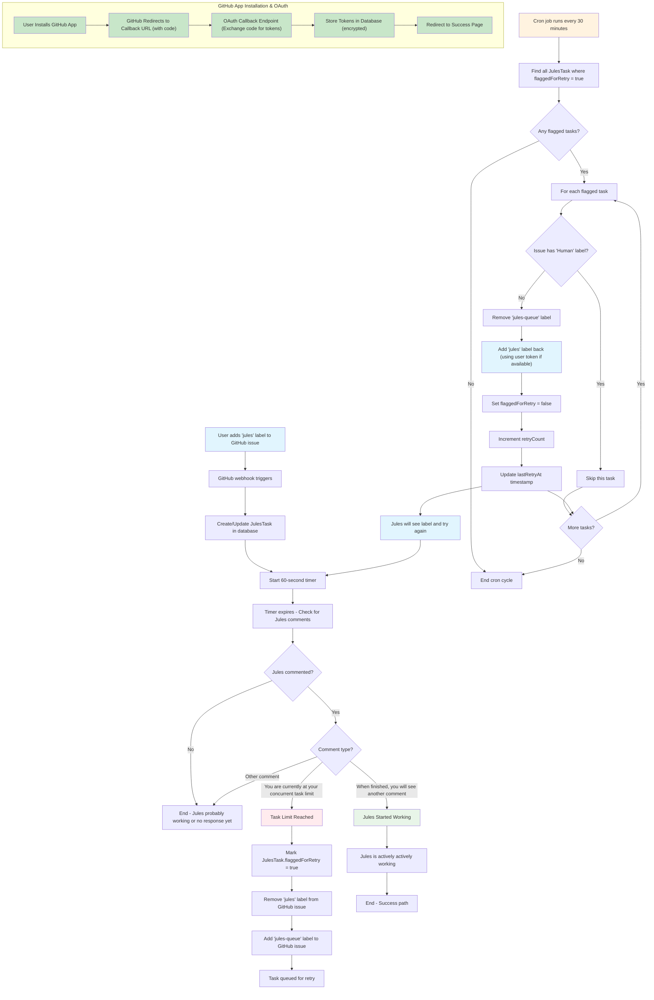

# Jules Task Queueing System

## Overview

The Jules Task Queueing System is a GitHub-integrated service that manages task overflow for the Google Labs Jules AI assistant. When Jules reaches its concurrent task limit, this system automatically queues tasks and retries them at regular intervals.

## System Architecture

## Key Components

### 1. GitHub Webhook Handler

- **Trigger**: When `jules` label is added to an issue
- **Action**: Creates/updates JulesTask record
- **Delay**: Waits 60 seconds before checking for bot responses

### 2. Comment Detection System

- **Purpose**: Monitors Jules responses after label application
- **Detection Patterns**:
  - Task limit: `"You are currently at your concurrent task limit"`
  - Success: `"When finished, you will see another comment"`

### 3. Queue Management

- **Queueing**: Moves tasks from `jules` → `jules-queue` when limit reached
- **Retry Logic**: Cron job processes queued tasks every 30 minutes
- **Safety**: Skips tasks with `Human` label (manual intervention required)
